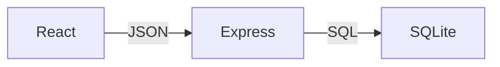
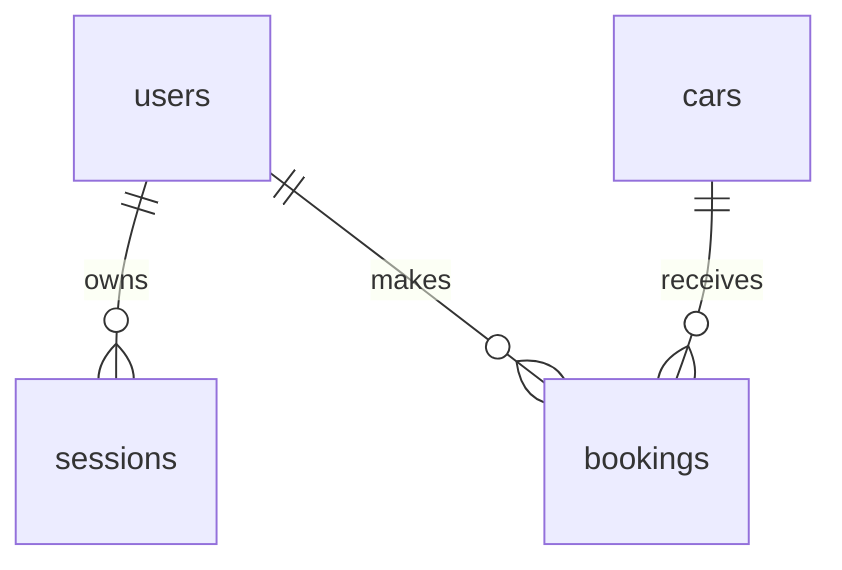
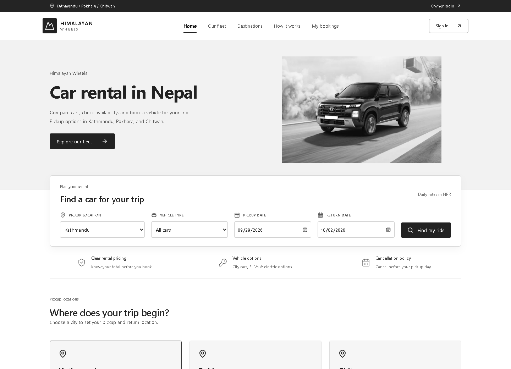
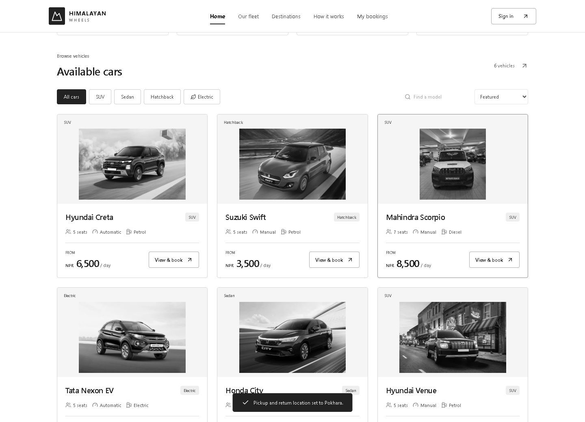
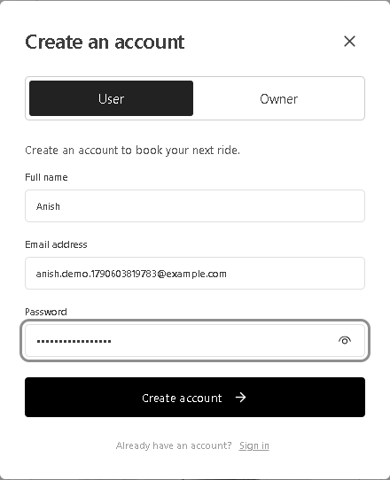
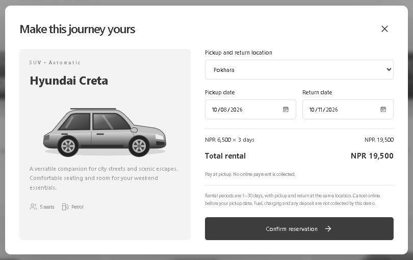
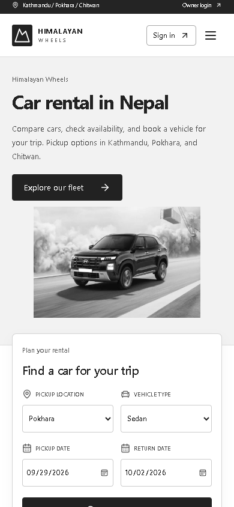
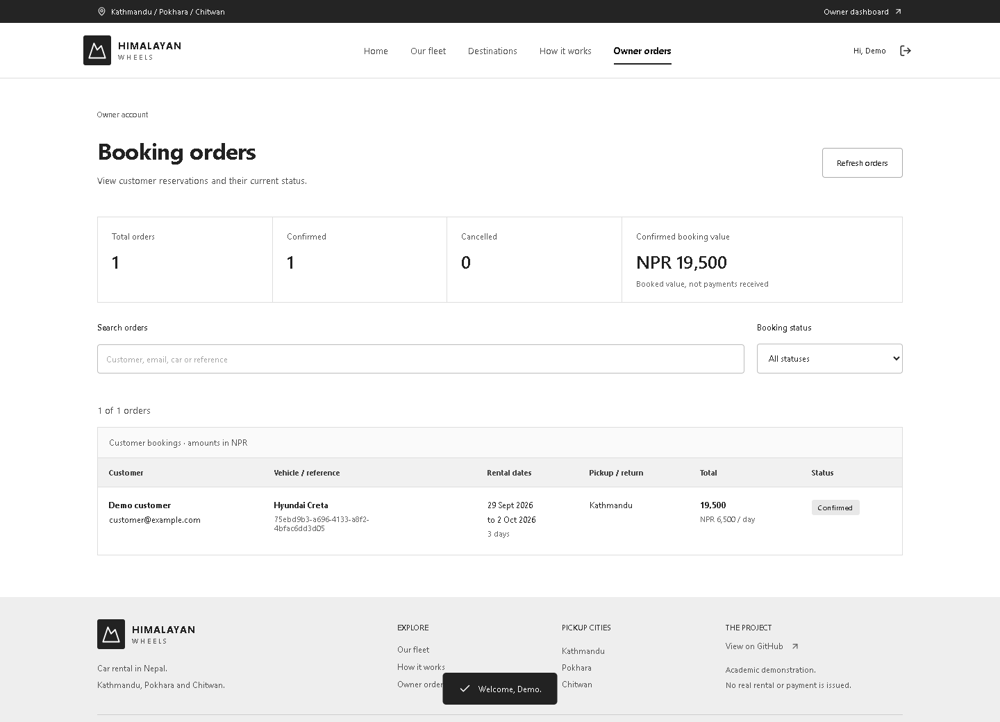

<!-- Page 1 -->
# Cover Page

Himalayan Wheels
Full Stack Car Rental System
Project Report

Submitted by: [Student name]
Roll number: [Roll number]
Program and semester: [Program and semester]
Submitted to: [College or university]
Department: [Department]
Supervisor: [Supervisor name]
September 2026

<!-- Page 2 -->
# Acknowledgement

I acknowledge the maintainers of React, Node.js, Express, SQLite, Vite, and the other open-source tools used in Himalayan Wheels. Their software and public documentation provided the foundation for implementing and understanding this application. I also acknowledge the security and database reference materials cited in this report, which informed the design and its limitations.

This project brings together interface design, server development, database modeling, and verification in one working educational system. It is presented as a practical demonstration of a car rental booking workflow.

## Abstract

Himalayan Wheels is a full-stack car rental demonstration designed for browsing vehicles and managing reservations in a Nepal-focused setting. The system presents a six-vehicle sample fleet, sample daily rates in Nepalese rupees, and pickup choices in Kathmandu, Pokhara, and Chitwan. Visitors can explore vehicle categories, search models, sort prices, and check availability for selected dates. Registered users can reserve a vehicle, review their own booking history, and cancel a reservation before its pickup date. Rental owners can sign in to review customer booking orders.

The frontend uses React and responsive CSS. An Express API implements authentication, booking rules, and authorization, while SQLite stores users, sessions, cars, and bookings. The server calculates the rental total from its own daily rate and validates the date range. A transaction encloses the final availability check and insertion so that overlapping confirmed bookings for the same vehicle are rejected.

Verification covered account isolation, authoritative pricing, conflicting reservations, adjacent date ranges, cancellation, persistence after restart, and browser interactions on desktop and mobile. The resulting application demonstrates an end-to-end reservation workflow. It does not process payments, verify driver documents, or operate a real rental fleet. Source code, setup instructions, test automation, screenshots, and this report are organized for publication in the project GitHub repository.

Keywords: React, car rental, reservation, Express, SQLite, date availability, full-stack web application.

<!-- Page 3 -->
# Table of Contents

- Cover Page — page 1
- Acknowledgement — page 2
- Abstract — page 2
- Table of Contents — page 3
- List of Abbreviations — page 4
- List of Figures — page 4
- List of Tables — page 4
- GitHub Repository Link and QR Code — page 5
- Introduction — page 5
- Problem Statement — page 6
- Objectives — page 6
- Literature Review — page 7
- Scope and Limitations — page 8
- Requirement Analysis — page 8
- Technology Stack — page 9
- Methodology — page 10
- Implementation — page 11
- Project Structure and File Organization — page 13
- System Screenshots — page 14
- Challenges Faced — page 17
- Conclusion — page 18
- Future Enhancements — page 18
- References — page 19
- Appendix — page 20
- Appendix: Owner and User Accounts — page 21

<!-- Page 4 -->
# List of Abbreviations

| Abbreviation | Meaning |
| --- | --- |
| API | Application Programming Interface |
| CI | Continuous Integration |
| CSS | Cascading Style Sheets |
| DB | Database |
| EV | Electric Vehicle |
| FK | Foreign Key |
| HTTP / HTTPS | Hypertext Transfer Protocol / HTTP over TLS |
| JSON | JavaScript Object Notation |
| NPR | Nepalese Rupee |
| PK | Primary Key |
| QR | Quick Response |
| REST | Representational State Transfer |
| SQL | Structured Query Language |
| SVG | Scalable Vector Graphics |
| UI | User Interface |
| UUID | Universally Unique Identifier |

## List of Figures

Figure 1  GitHub repository QR code ........................................ 5
Figure 2  Application architecture ........................................... 10
Figure 3  Entity relationships .................................................. 11
Figure 4  Homepage and vehicle discovery ................................ 14
Figure 5  Fleet browsing ........................................................ 14
Figure 6  Account registration ................................................. 15
Figure 7  Reservation and price review ..................................... 15
Figure 8  Booking history ........................................................ 16
Figure 9  Mobile homepage .................................................... 16
Figure 10  Owner booking dashboard ..................................... 21

## List of Tables

Table 1  Functional requirements ............................................. 8
Table 2  Technology stack ....................................................... 9
Table 3  Database entities ....................................................... 11
Table 4  API endpoints ........................................................... 12
Table 5  Validation results ....................................................... 17
Table 6  Runtime configuration ............................................... 20

<!-- Page 5 -->
# GitHub Repository Link and QR Code

The project repository is available at https://github.com/Anish00079/Himalayan-Wheels-. The QR code below encodes this HTTPS address, which is suitable for opening in a browser. The SSH clone address supplied for the project is git@github.com:Anish00079/Himalayan-Wheels-.git.


The repository groups the React frontend, Express backend, database initializer, test suite, setup guide, deployment starting files, and academic report. The website preview at https://anish00079.github.io/Himalayan-Wheels-/ runs on GitHub Pages. It uses a clearly labelled browser-only demo workspace without passwords or shared bookings. The full-stack build still requires an application host, HTTPS, and persistent database storage.

## Introduction

A car rental workflow connects a travel plan to a particular vehicle over a defined period. A useful web interface must help the customer compare options, understand the price, and determine whether the selected vehicle can actually be reserved. Behind that interface, the system must distinguish one customer from another, retain bookings, and prevent conflicting allocations.

Himalayan Wheels models this workflow with a small Nepal-oriented sample fleet. It focuses on the transition from public vehicle discovery to authenticated reservation management. The client provides immediate interaction and price previews; the server remains responsible for deciding whether a booking is valid. This division makes the project suitable for demonstrating the relationship between presentation, business rules, and persistent data.

The intended users are visitors browsing the fleet, registered customers managing their own bookings, and rental owners reviewing customer orders. The owner dashboard is read-only and uses backend role checks. It is not a commercial fleet-management system.

<!-- Page 6 -->
# Problem Statement

A booking interface is incomplete if it only displays cars and accepts form submissions. It must also resolve practical questions: Is the selected vehicle already reserved? Are the dates valid? Is the quoted price calculated from the correct rate? Can one customer access or cancel another customer's reservation? Does a confirmed booking remain available after a server restart?

When availability checks are separated from booking creation, two requests can both observe an available vehicle and produce conflicting reservations. When totals are accepted from the browser, the submitted price can be manipulated. When booking queries are not restricted by user identity, personal reservation information can be exposed. These are specific implementation problems addressed by this project; no claim is made about their prevalence in any particular rental business.

## Objectives

The primary objective is to develop a working React-based car rental application with an authenticated backend and a persistent relational database. The implementation should support a complete customer journey and make its booking rules visible and testable.

- Provide a public fleet with model search, category selection, price sorting, and readable vehicle details.
- Check availability for valid date ranges of one to thirty days using the Nepal calendar.
- Register and authenticate users, maintain sessions, and restrict booking history and cancellation to the owner.
- Calculate each total on the server and store the daily rate, day count, and total as a booking snapshot.
- Prevent overlapping confirmed bookings through a transactional check and insertion.
- Allow cancellation before the pickup date and release availability while preserving the booking record.
- Verify key API rules, persistence, browser workflows, and mobile layout; provide a reproducible project report.

## Acceptance criteria

The core workflow is accepted when a visitor can find a vehicle, create an account, confirm a valid reservation, reload the application, view the saved booking, and cancel it before pickup. Negative checks must show that invalid dates, price tampering, conflicting bookings, and unauthorized cancellation do not succeed.

<!-- Page 7 -->
# Literature Review

This section reviews technical documentation relevant to the implemented system. It is a focused engineering review, rather than a systematic survey of academic research or a market comparison of rental providers.

## Component based interfaces

React describes interfaces through components, event handlers, state, and conditional rendering [1]. These concepts support reusable vehicle cards, authentication forms, and reservation dialogs. Himalayan Wheels applies them to keep the selected trip, visible fleet, signed-in user, and booking screens synchronized. The benefit is a consistent interactive workflow without a full document reload after every action.

## Server responsibilities and security

Express documentation explains application setup and production security practices, including transport security, input handling, and defensive response headers [2, 3]. This project places authorization and rental validation in the server instead of relying on hidden frontend controls. OWASP recommends salted, deliberately expensive password hashing [4]. The implementation uses scrypt with explicit work parameters, and stores session-token digests separately from password hashes. These controls are a foundation, not evidence of a complete security audit.

## Relational persistence and reservation intervals

SQLite is an embedded relational database suited to local and modest single-server applications [5]. Its transaction documentation explains how an immediate transaction obtains a write transaction before dependent changes proceed [6]. Himalayan Wheels uses that mechanism around the availability check and booking insert. Node exposes the database through its built-in SQLite module [7], reducing the number of separately installed services needed for a classroom demonstration.

PostgreSQL documents range values and exclusion constraints as tools for expressing interval restrictions [8]. That approach provides a useful future direction if this project moves to a larger database. The current implementation instead expresses overlap as two comparisons over ISO date strings and applies that rule in one SQLite transaction.

## Design conclusion

The review supports a three-part design: a component-based client, an authoritative API, and a relational store. The project prioritizes transparent booking rules and a small setup footprint. The resulting design is deliberately narrower than a commercial rental platform, which would also need operational inventory, payments, document checks, and customer support workflows.

<!-- Page 8 -->
# Scope and Limitations

The implemented scope covers public discovery and private reservation management. Six seeded records represent six physical demo vehicles. Model specifications and daily rates are illustrative data, not verified manufacturer specifications or market quotations. Vehicle photos from Meromoto are included as local assets, with source details in Image-Credits.md. The website uses a grey, black, and white interface.

The customer selects one of three pickup cities and returns the vehicle to the same city. The application does not model where a vehicle is physically located, repositioning between cities, pickup times, driver services, maintenance blocks, or turnaround buffers. A return date is exclusive, so another rental can start on that date. These assumptions simplify the demonstration and must be revisited before commercial use.

The optional GitHub Pages preview uses local browser storage and a demo identity; it does not provide the authentication or shared-database guarantees of the full-stack application. No money, driving license, identity document, or insurance information is collected. Payment is described as due at pickup, but no actual rental service is issued. A read-only owner dashboard is included. Email verification, password reset, notifications, and broader staff operations remain outside the scope. SQLite is used on a single application server; horizontal scaling is outside the current scope.

## Requirement Analysis

Table 1  Functional requirements

| ID | Requirement | Acceptance evidence |
| --- | --- | --- |
| FR1 | Browse and compare the fleet | Six cars load; categories, search and price sorting work. |
| FR2 | Check valid date availability | Unavailable cars are marked; invalid ranges are rejected. |
| FR3 | Register and authenticate | Valid accounts receive a session; invalid credentials fail. |
| FR4 | Create an owned reservation | Signed-in users receive a stored booking reference. |
| FR5 | Calculate authoritative totals | Client-supplied totals are ignored; daily rate × days is stored. |
| FR6 | Reject overlapping reservations | A second conflicting booking returns HTTP 409. |
| FR7 | Manage private bookings | History and cancellation are limited to the booking owner. |
| FR8 | Cancel future reservations | Cancellation changes status and releases availability. |
| FR9 | Owner order dashboard | Only owners can read all customer booking orders. |

<!-- Page 9 -->
# Requirement Analysis and Technology Stack

## Nonfunctional requirements

- Usability: labelled forms, visible errors, a responsive layout, keyboard-operable controls, and dialogs that restore focus.
- Integrity: transactional booking creation, foreign keys, validated date ranges, and server-owned pricing.
- Privacy: private booking queries, hashed passwords, hashed session tokens, HttpOnly cookies, and session expiry.
- Maintainability: separate client and server directories, reproducible dependencies, tests, readable formatting, and setup documentation.
- Portability: Node.js 24 or newer and a modern browser; no separate database service is required for local use.

## Technology Stack

Table 2  Technology stack

| Layer | Technology | Role |
| --- | --- | --- |
| User interface | React 19.3.0 | Component rendering, state, events and dialogs |
| Build tools | Vite 7.3.6 | Development server and frontend production bundle |
| Server runtime | Node.js 24+ | JavaScript execution, cryptography and SQLite API |
| API framework | Express 5.2.1 | Routes, middleware, JSON responses and static serving |
| Database | SQLite through node:sqlite | Durable users, sessions, vehicle and booking records |
| Security middleware | Helmet 8.3.0; express-rate-limit 8.7.0 | Response headers and authentication attempt limits |
| Visual interface | CSS, SVG; Lucide React 0.468.0 | Responsive styling, vehicle photos and icons |
| Verification | Node test runner; Playwright browser checks | API assertions and end-to-end interaction checks |
| Source management | Git and GitHub Actions | Version history and automated test/build workflow |

Exact package resolutions are recorded in package-lock.json. Vite provides a development server and a production build pipeline [9]. During development its proxy forwards API requests to Express; in the production build Express serves the generated frontend from the same origin as the API.

<!-- Page 10 -->
# Methodology

Development followed an iterative implementation and verification process. Each iteration tied a visible customer action to a server rule and a stored record. The sequence began with the domain model and reservation rules, continued through the API and interface, and ended with negative tests, browser checks, and documentation.

- Define the journey: browse, select dates, sign in, review the price, confirm, view, and cancel.
- Model the data: separate users, sessions, cars, and bookings; define ownership and foreign keys.
- Implement server rules: validate dates, derive prices, protect endpoints, and control overlap in a transaction.
- Build the interface: responsive navigation, vehicle photo cards, dialogs, availability indicators, and booking history.
- Verify behavior: test successful and rejected requests, restart persistence, race attempts, and browser interaction.
- Package the result: retain source, dependency lockfile, setup instructions, screenshots, report, and CI workflow.



## Request and data flow

The browser sends JSON requests to the API and includes the session cookie automatically. Public requests can retrieve the fleet. A protected route first resolves the session to a user. Booking creation then checks the car, city, dates, and conflicting confirmed bookings before committing the record. The response updates the client view and the booking history.

The application uses a same-origin deployment model. No cross-origin API access is enabled. Each state-changing browser request includes a custom verification header; the session cookie is HttpOnly and SameSite Strict. The production setting additionally requires secure cookies over HTTPS. These controls are implemented alongside server-side authorization, rather than replacing it.

<!-- Page 11 -->
# Implementation of the Data Layer

The database initializer creates four related tables, enables foreign keys and write-ahead logging, and seeds the six demonstration vehicles idempotently. Existing accounts and reservations remain untouched when the server restarts. All runtime queries use bound parameters instead of concatenating user input into SQL.

Table 3  Database entities

| Entity | Key fields | Relationships and purpose |
| --- | --- | --- |
| users | id PK; name; email UNIQUE; password; role | Customer or owner role; stores a salted password hash. |
| sessions | token PK; user_id FK; expires | Maps a token digest to one user until the expiry time. |
| cars | id PK; name; category; seats; transmission; fuel; price; color; description | One record represents one reservable physical demo vehicle. |
| bookings | id PK; user_id FK; car_id FK; pickup; start_date; end_date; days; daily_rate; total; status; created_at | Stores ownership, interval, rate snapshot, total and cancellation status. |



## Availability and total calculation

A conflict exists when an existing confirmed booking starts before the requested return date and ends after the requested pickup date. Cancelled bookings are excluded. Both comparisons are strict, which permits adjacent reservations with no overlap. The date strings use YYYY-MM-DD, so validated values can be compared consistently.

```text
existing.start_date < requested.end_date
AND existing.end_date > requested.start_date

days = (end_date - start_date) / 86,400,000
total = days * server_stored_daily_rate
```

The server begins an immediate transaction, repeats the overlap check, inserts the reservation, and commits. A conflict rolls back and returns HTTP 409. The stored rate and total preserve the original quote if the fleet rate is changed later. Integer NPR values avoid floating-point rounding in this model.

<!-- Page 12 -->
# Implementation of the Application Layer

Table 4  API endpoints

| Method and path | Access | Behavior |
| --- | --- | --- |
| GET /api/cars | Public | Returns fleet and optional date availability. |
| POST /api/auth/register | Public | Validates identity fields and creates an account. |
| POST /api/auth/login | Public | Checks credentials and starts a session. |
| GET /api/auth/me | Signed in | Returns the current user identity. |
| POST /api/auth/logout | Signed in | Removes the session and clears its cookie. |
| GET /api/bookings | Signed in | Returns only the current user's reservations. |
| POST /api/bookings | Customer | Validates and transactionally reserves a vehicle. |
| PATCH /api/bookings/:id/cancel | Customer | Cancels a confirmed future reservation. |
| GET /api/health | Public | Returns an application health response. |
| GET /api/owner/bookings | Owner | Lists all customer booking orders. |

## Authentication and session handling

Registration requires a name, an email-shaped address, and an 8–128 character password. Email addresses are normalized to lowercase and must be unique. Passwords use scrypt with a random 16-byte salt, N=131072, r=8, p=1, and a 64-byte output. Authentication attempts are limited to 30 per 15-minute window per client address. This implementation uses synchronous hashing and is intended for modest demonstration traffic.

A successful authentication creates a random 32-byte token, stores its SHA-256 digest, and sets a seven-day session cookie. The raw token is not stored in the database. Protected handlers obtain the user identity from the session rather than accepting a user ID from the browser. Cancellation checks the booking ID and customer ID. Owner routes additionally require the owner role from the database; public registration cannot grant that role.

## Frontend state and feedback

React state tracks the chosen trip, selected vehicle, authentication dialog, fleet filters, bookings, and messages. Date changes clear prior availability markers to avoid showing stale results. A guest can start a reservation and sign in without losing edited trip details. Busy states reduce repeated submissions; server errors remain visible when a reservation fails. Native dialog behavior and explicit focus restoration support keyboard use.

HTTP responses distinguish malformed input (400), missing authentication (401), failed verification or role checks (403), unavailable records (404), and reservation conflicts (409). Successful creation returns 201. The UI displays the corresponding message and keeps the user in the relevant workflow.

<!-- Page 13 -->
# Project Structure and File Organization

```text
Himalayan-Wheels/
  src/
    main.jsx                 React components and API client
    styles.css               Responsive site design
    preview-api.js           Browser-only Pages adapter
    OwnerDashboard.jsx       Customer order overview
  shared/fleet.js            Shared demonstration fleet
  server/
    app.js                   Routes and booking rules
    db.js                    Schema and demo fleet
    index.js                 Startup and graceful shutdown
    create-owner.js          Local owner setup command
  tests/
    api.test.js              API integration scenario
  docs/
    Himalayan-Wheels-Project-Report.pdf
    Project-Report.md        Editable report text
    build_report.py          Report generation source
    repository-qr.svg        Scannable repository link
    screenshots/             Browser screenshots
  .github/workflows/ci.yml    Automated verification
  Dockerfile                 Container starting configuration
  .dockerignore              Excludes local build/data files
  .gitignore                 Excludes dependencies and data
  index.html                 Frontend entry point
  vite.config.js             Build configuration and proxy
  package.json               Scripts and dependency ranges
  package-lock.json          Exact dependency resolutions
  README.md                  Setup, usage and API guide
```

## Organization decisions

The client and server are separated by directory and communicate only through the API. The frontend uses reusable components for the logo, vehicle photos, modal, authentication, and booking form. The App component coordinates navigation and shared state. The database module initializes schema and fleet data; app.js defines API rules. OwnerDashboard.jsx renders orders, owners.js provisions owner accounts, and passwords.js shares password hashing.

Generated dependencies, frontend build output, local logs, and database files are excluded from Git. The source repository retains the dependency lockfile so another developer can reproduce the installation with npm ci. Tests create a disposable database in the operating system temporary directory, avoiding changes to the user's demonstration data.

A GitHub Actions workflow installs dependencies, runs the API tests, and builds the frontend on Node 24. The Dockerfile is supplied for a later hosting step. Its build and runtime behavior have not been executed as part of this native Windows verification, so it should be smoke-tested before deployment.

<!-- Page 14 -->
# System Screenshots

The following figures were captured from the running application in a desktop browser. The visible fleet, prices, and accounts are demonstration data. Screenshots illustrate the actual implemented interface rather than a separate design mockup.





<!-- Page 15 -->
# System Screenshots of Registration and Reservation



A visitor can create an account within the booking journey. Password characters are obscured in the interface, and the API validates account details before starting a session.



The example shows a three-day Hyundai Creta booking at NPR 6,500 per day, producing NPR 19,500. The browser displays a preview, while the server recalculates the total from stored fleet data. The interface states that payment is at pickup and no online payment is collected.

<!-- Page 16 -->
# System Screenshots of Bookings and Mobile Layout




Figure 9 Mobile homepage
At a 390-pixel viewport, navigation moves into a menu, the vehicle photo is resized, and the search form becomes a compact stacked layout. Fleet cards become a single column.
Browser checks found no horizontal page overflow at this width. The same booking and account features remain accessible. This visual check does not replace a complete accessibility audit.
The booking history above shows the saved reference, rental dates, pickup city and total. Cancellation is offered only before the pickup date; cancelled reservations remain in history.

<!-- Page 17 -->
# Challenges Faced

## Maintaining consistent availability

A date search only provides a snapshot. Another request can reserve the car before confirmation. The solution is to recheck overlap inside the same transaction as the insert and return a conflict message when necessary. The test suite also submits competing requests and verifies that only one succeeds.

## Preserving trip state across authentication

A guest may change the pickup location or dates in a booking dialog before signing in. Replacing that dialog with the authentication form initially risked resetting those edits. The final implementation copies the edited trip into parent state before opening authentication, then restores it when the reservation dialog returns. Browser verification confirmed that the selected city was retained.

## Separating price previews from booking authority

The interface needs instant pricing feedback, but a submitted browser value cannot define the charge. Both layers compute the visible day count, while only the server reads the authoritative daily rate and persists the total. A test submits a false total of NPR 1 and verifies that the stored total remains NPR 19,500 for the three-day example.

## Verification results

Table 5  Validation results

| Area | Observed result |
| --- | --- |
| Authentication and ownership | Passed registration, login, logout, duplicate account and private-booking checks. |
| Dates and totals | Passed past-date, impossible-date, range-length and price-tampering checks. |
| Conflict handling | Passed overlapping, contained, surrounding, adjacent and competing reservation checks. |
| Cancellation | Passed owner-only cancellation, release of dates, repeat cancellation and pickup-day restriction. |
| Persistence | Passed booking and session retrieval after closing and reopening the server and database. |
| Browser workflow | Passed browsing, search, sort, account creation, booking, reload, cancellation and login/logout. |
| Mobile and build | No horizontal overflow at 390 px; no browser JavaScript errors; production build passed. |

These checks establish the tested behavior, not production readiness. No load benchmark, penetration test, screen-reader audit, real payment integration, or commercial fleet validation was performed.

<!-- Page 18 -->
# Conclusion

Himalayan Wheels implements the core customer journey of a car rental system: vehicle discovery, date selection, authentication, reservation, booking history, and cancellation. React delivers an interactive interface, Express enforces application rules, and SQLite retains the records required to connect users to vehicles over time.

The most significant result is the consistency between the visible workflow and the server-side rules. The price displayed to the customer is backed by a server calculation; availability is rechecked at confirmation; cancellation belongs to the reservation owner; and data survives a restart. The completed tests and browser checks provide evidence for these behaviors within the defined educational scope.

The application and report are suitable for local demonstration, source review, and further development. Publishing the repository supplies the code and documentation; running a public service requires a separate hosting and operational step. The project does not represent a real rental business, validated fleet inventory, or a payment-capable commercial platform.

## Future Enhancements

- Staff operations: extend the read-only owner dashboard with audited fleet updates, maintenance blocks, pickup and return inspections, and controlled booking changes.
- Real inventory: model each vehicle's actual branch, relocation time, pickup and return timestamps, cleaning buffers, and location-dependent availability.
- Customer accounts: add verified email, password recovery, configurable cancellation terms, notification delivery, and downloadable booking documents.
- Payments: integrate a supported payment provider, verified callbacks, idempotency controls, deposits, refunds, and reconciliation before accepting real money.
- Database scaling: migrate to a coordinated server database and evaluate range exclusion constraints for conflict enforcement across multiple application instances.
- Accessibility and localization: add Nepali language support, screen-reader testing, contrast auditing, and broader device coverage.
- Operations: deploy behind HTTPS, establish persistent storage and backups, monitor errors, benchmark capacity, and perform a security review.

The suggested sequence is to strengthen real inventory and operational rules first, then improve identity and accessibility, and only then enable public transactions. Each expansion should introduce corresponding tests and revise the report's scope and assumptions.

<!-- Page 19 -->
# References

[1] React. Quick Start. Documentation accessed 28 September 2026.
https://react.dev/learn

[2] Express. Installing Express. Documentation accessed 28 September 2026.
https://expressjs.com/en/starter/installing/

[3] Express. Production Best Practices Security. Documentation accessed 28 September 2026.
https://expressjs.com/en/advanced/best-practice-security/

[4] OWASP Cheat Sheet Series. Password Storage Cheat Sheet. Documentation accessed 28 September 2026.
https://cheatsheetseries.owasp.org/cheatsheets/Password_Storage_Cheat_Sheet.html

[5] SQLite. Appropriate Uses For SQLite. Documentation accessed 28 September 2026.
https://www.sqlite.org/whentouse.html

[6] SQLite. Transaction. Documentation accessed 28 September 2026.
https://www.sqlite.org/lang_transaction.html

[7] Node.js. SQLite API Documentation. Documentation accessed 28 September 2026.
https://nodejs.org/api/sqlite.html

[8] PostgreSQL Global Development Group. Range Types. Documentation accessed 28 September 2026.
https://www.postgresql.org/docs/current/rangetypes.html

[9] Vite. Getting Started. Documentation accessed 28 September 2026.
https://vite.dev/guide/

[10] Himalayan Wheels. Project source repository. Project repository.
https://github.com/Anish00079/Himalayan-Wheels-

## Source use

The cited documentation supports the technical design discussion. Package versions in the technology table come from the delivered dependency lockfile. Implementation descriptions and validation results refer to the delivered source and executed tests. Fleet data and rates are project examples. Sajilo Rental (https://sajilorental.com/) informed the search, destination, and category layout; business claims and customer reviews were not reused. Vehicle photographs are sourced from Meromoto (https://meromoto.com/), with individual source links in Image-Credits.md.

<!-- Page 20 -->
# Appendix

## Installation and first run

Install Node.js 24 or newer. Clone or download the repository, open a terminal in the project folder, and run the following commands. A network connection is needed to install packages. The built website uses local assets and a local database.

```text
npm ci
npm run build
npm start

Open http://localhost:3001
```

Browse the fleet and select travel dates. Use Sign in and Create an account to register. Reserve a vehicle, inspect My bookings, and cancel a future booking if desired. To run the integration checks, execute npm test. For development, stop the current server and use npm run dev, then open http://localhost:5173.

Table 6  Runtime configuration

| Variable | Default | Use |
| --- | --- | --- |
| PORT | 3001 | Server port |
| HOST | 127.0.0.1 | Bind interface; containers usually use 0.0.0.0 |
| DB_PATH | data/himalayan-wheels.sqlite | Persistent database file |
| NODE_ENV | Unset | production enables secure cookies; requires HTTPS |
| TRUST_PROXY | Unset | Use 1 only behind one trusted reverse proxy |

## Maintenance and troubleshooting

If the port is in use, stop the earlier server or select another PORT. If the frontend is absent, run npm run build before npm start. An experimental SQLite warning may appear on some Node 24 versions; inspect the actual server result rather than treating the warning as a test failure. If production cookies do not persist on plain HTTP, use HTTPS or run the local demonstration without NODE_ENV=production.

Stop the server before backing up the entire data folder. Do not commit the database, session records, or local secrets. A live deployment must preserve the database across releases. GitHub Pages cannot run this API; the repository is the publication destination for this delivery, and full-stack hosting is a separate future step. The Pages preview uses local browser storage and does not exercise the server authentication or shared reservation database.

Before academic submission, replace the cover-page fields for student name, roll number, institution, course, and supervisor. The editable Markdown report and the Python report source are included so the document can be customized.

<!-- Page 21 -->
# Appendix: Owner and User Accounts

## Local owner account setup

Run npm run owner:create in the project folder. Enter an owner name, a separate email, and a password of 12-128 characters. Password input is hidden and requires confirmation. If DB_PATH is customized, use the same value as the application server. Existing customer accounts are not promoted or overwritten.

Customers choose User in the sign-in form and create an account to reserve a car. Owners choose Owner login and enter the credentials created above. Public registration always stores the customer role. Existing databases are migrated without removing users or reservations.



The owner dashboard includes customer names and emails, vehicles, dates, location, totals, and status. Owners can search, filter by status, and refresh orders. Confirmed booking value is not payment revenue. Server checks reject unauthenticated access and customer access to the owner endpoint.

## GitHub demo and verification

The Pages demo offers User and Owner choices without passwords. Create a booking as the demo traveller, sign out, and continue as the demo owner in the same browser. These are browser-only sample orders. Tests cover real owner login, customer isolation, role tampering, database migration, saved orders after restart, cancellation visibility, and responsive browser interaction.
